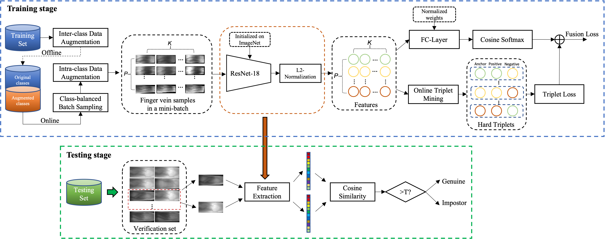

# FusionAug-PyTorch

> PyTorch implementation of [Fusion Loss and Inter-class Data Augmentation for Deep Finger Vein Feature Learning](https://www.sciencedirect.com/science/article/abs/pii/S0957417421000257?casa_token=3vLPMy3GobcAAAAA:yggNDxtgybur2OHa7VVb70Y34_WBJc6sIRe7gBpK9Pf3Ub3unob4H8fao50ugQHbUkDBivzCEw). A simple video demo is available at [youtube](https://www.youtube.com/watch?v=815MXXj2gtU), [bilibili](https://www.bilibili.com/video/BV1s5eZeEEtC/).

## Abstract
Finger vein recognition (FVR) based on deep learning (DL) has gained rising attention in recent years. However, the performance of FVR is limited by the insufficient amount of finger vein training data and the weak generalization of learned features. To address these limitations and improve the performance, we propose a simple framework by jointly considering intensive data augmentation, loss function design and network architecture selection. Firstly, we propose a simple inter-class data augmentation technique that can double the number of finger vein training classes with new vein patterns via vertical flipping. Then, we combine it with conventional intra-class data augmentation methods to achieve highly diversified expansion, thereby effectively resolving the data shortage problem. In order to enhance the discrimination of deep features, we design a fusion loss by incorporating the classification loss and the metric learning loss. We find that the fusion of these two penalty signals will lead to a good trade-off between the intra-class similarity and inter-class separability, thereby greatly improving the generalization ability of learned features. We also investigate various network architectures for FVR application in terms of performances and model complexities. To examine the reliability and efficiency of our proposed framework, we implement a real-time FVR system to perform end-to-end verification in a near-realworld working condition. In challenging open-set evaluation protocol, extensive experiments conducted on three public finger vein databases and an in-house database confirm the effectiveness of the proposed method.
<div align=center>

</div>

## Installation
Clone the repo and run
```bash
$ conda env create --file env.yml
$ conda activate fusionaug
```

## Data preparation
Download the [preprocessed FV-USM dataset](https://portland-my.sharepoint.com/:u:/g/personal/weifengou2-c_my_cityu_edu_hk/EZR-zf6MCxJOikdLh5Eb7X0BeiJEiIZ6cFLRWgCFdEWf-Q?e=uOV5aE), which has been divided by a trainset and a testset in non-overlapped vein classes. The trainset is used for training the feature embedding network while the testset is used for evaluating the open-set biometric verification performance.

## Training
By default, the bash script `run_train.sh` trains a resnet-18 feature embedding network with fusion loss, intra-class data augmentation as well as inter-class data augmentation. You can modify the parameters in the shell script to customize your own setting.
```bash
$ bash run_train.sh "path_to_trainset" "path_to_testset"
```

## Testing
```bash
$ python3 -u ./test.py --ckpt "path_to_checkpoint" --data "path_to_testset" --dataset_name "name of dataset, default: FVUSM" --network "name of network, default: resnet18"
```

## Results

|        Method        | Image size |                      Network                      | EER(%) (simplified protocol) | EER(%) (two-session protocol) |
|:--------------------:|------------|:-------------------------------------------------:|:----------------------------:|:-----------------------------:|
|      FusionAug       | 64*144     |                   [Resnet-18](https://portland-my.sharepoint.com/:u:/g/personal/weifengou2-c_my_cityu_edu_hk/EVZDlr-3bhVKu2rFEToZCiABNAkkXMo7H2mQci0VWeKuWA?e=u9gSZt)                   |             0.33             |             0.43              |
|      FusionAug       | 64*144     |                   [Resnet-34](https://portland-my.sharepoint.com/:u:/g/personal/weifengou2-c_my_cityu_edu_hk/EQopR6py69pNju1c1eR4E8sB6VvkMCc7adzG7Z9TuciPbQ?e=PBMPmD)                   |             0.27             |             0.30              |
|      FusionAug       | 64*144    |                   [Resnet-50](https://portland-my.sharepoint.com/:u:/g/personal/weifengou2-c_my_cityu_edu_hk/EYKPmBU9gFJCjtkVdZ__hrEBVLAcUbuT9JKyde5E3O8OpQ?e=o4eXGR)                   |             0.41             |             0.52              |

### Note:
The original paper has employed a simplified evaluation protocol where the genuine pairs are obtained by pairing all intra-class samples and the imposter pairs are produced by pairing only the first sample of each vein class. In practical biometric verification scenarios, the enrolled image and the probing image are usually acquired at different time, so constructing the genuine and imposter pairs with images from different sessions is more compatible with the actual working conditions. The two-session evaluation protocol is more challenging than the simplified protocol, so usually measures a slightly higher error rates for the same model. 

## Acknowledgement
* The copyright of the [FV-USM database](http://drfendi.com/fv_usm_database/) is owned by Dr. Bakhtiar Affendi Rosdi, School of Electrical and Electronic Engineering, USM.
* This code is inspired by and built upon several public projects, many thanks to the authors.
  * https://github.com/adambielski/siamese-triplet/tree/master
  * https://github.com/sthalles/PyTorch-BYOL/

## Citation
```bibtex
@article{ou2021fusion,
  title={Fusion loss and inter-class data augmentation for deep finger vein feature learning},
  author={Ou, Wei-Feng and Po, Lai-Man and Zhou, Chang and Rehman, Yasar Abbas Ur and Xian, Peng-Fei and Zhang, Yu-Jia},
  journal={Expert Systems with Applications},
  volume={171},
  pages={114584},
  year={2021},
  publisher={Elsevier}
}

@article{asaari2014fusion,
  title={Fusion of band limited phase only correlation and width centroid contour distance for finger based biometrics},
  author={Asaari, Mohd Shahrimie Mohd and Suandi, Shahrel A and Rosdi, Bakhtiar Affendi},
  journal={Expert Systems with Applications},
  volume={41},
  number={7},
  pages={3367--3382},
  year={2014},
  publisher={Elsevier}
}

@inproceedings{schroff2015facenet,
  title={Facenet: A unified embedding for face recognition and clustering},
  author={Schroff, Florian and Kalenichenko, Dmitry and Philbin, James},
  booktitle={Proceedings of the IEEE conference on computer vision and pattern recognition},
  pages={815--823},
  year={2015}
}

@inproceedings{wang2018cosface,
  title={Cosface: Large margin cosine loss for deep face recognition},
  author={Wang, Hao and Wang, Yitong and Zhou, Zheng and Ji, Xing and Gong, Dihong and Zhou, Jingchao and Li, Zhifeng and Liu, Wei},
  booktitle={Proceedings of the IEEE conference on computer vision and pattern recognition},
  pages={5265--5274},
  year={2018}
}

```
